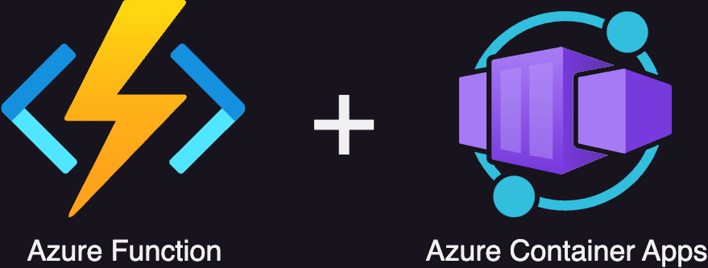

# Azure Function hosted in the Azure Container Apps

## Build status

## What Does This Repo Contain?
In May 2024, the option to run Azure Functions on Azure Container Apps was released.
In this repo, you can find:
* A Terraform script for creating Azure Container Apps and building a Docker image.
* A Python app with an Azure Storage Account Trigger.